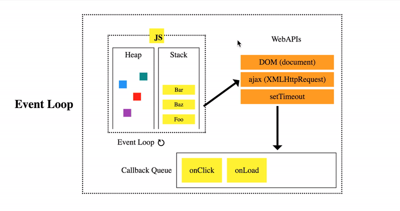

# Week 1.5

## In this lecture, we covered these topics:
1. Async functions vs sync functions
2. Promise
3. Async await

## 1. Async functions vs sync functions
**Asynchronous** is a non-blocking architecture, so the execution of one task isn't dependent on another. Tasks can run simultaneously. Whereas, **Synchronous** is a blocking architecture, so the execution of each operation depends on completing the one before it. Each task requires an answer before moving on to the next iteration.

**Synchronous Javascript**:  
As the name suggests synchronous means to be in a sequence, i.e. every statement of the code gets executed one by one. So, basically a statement has to wait for the earlier statement to get executed.
```js
document.write("Hi"); // First 
document.write("<br>");
 
document.write("Mayukh");// Second 
document.write("<br>");
 
document.write("How are you"); // Third
```
Output : 
```
Hi
Mayukh
How are you
```
So as we can see, the code works in a sequence. Every line of code wait for its previous one to get executed, and then it gets executed.

**Asynchronous Javascript**:  
```js
document.write("Hi");
document.write("<br>");
 
setTimeout(() => {
    document.write("Let us see what happens");
}, 2000);
 
document.write("<br>");
document.write("End");
document.write("<br>");
```
Output :
```
Hi
End
Let us see what happens
```
At first, as usual, the Hi statement got logged in. As we use browsers to run JavaScript, there are something known as `web APIs` that handle async functions for us. So, what JavaScript does is, it passes the setTimeout function in one such web API and then moves forward with running the code as usual. So it does not block the rest of the code from executing. After the Web api is done with that async code, it pushes the code inside the `callback queue`. Now comes the `event loop`, which runs continuously and checks the Main stack(the call stack), if it has any frames to execute. if not, then it checks the callback queue. If the callback queue has codes to execute, then it pops the message(code) from it and pushes it to the Main Stack for the execution. This is what happens in asynchronous JavaScript.



## 2. Promise
In JavaScript, a Promise is an object that will produce a single value some time in the future. If the promise is successful, it will produce a resolved value, but if something goes wrong then it will produce a reason why the promise failed

This is how you create a promise :
```js
const promise = new Promise((resolve, reject) => {
  // Condition to resolve or reject the promise
});
```
For example, assume you want a promise to resolve after a timeout of two seconds. You can achieve this by writing it into the parameter of the constructor function.

```js
const promise = new Promise((resolve, reject) => {
  setTimeout(() => resolve("Done!"), 2000);
});
```
In promises, resolve is a function with an optional parameter representing the resolved value. Also, reject is a function with an optional parameter representing the reason why the promise failed. In the example above, the resolved value of the promise is the string 'Done!'.

Here is yet another example showing how you can resolve or reject a promise based on the conditions you set. In this example, the outcome of the promise is based on a random number the program generates.
```js
const promise = new Promise((resolve, reject) => {
  const num = Math.random();
  if (num >= 0.5) {
    resolve("Promise is fulfilled!");
  } else {
    reject("Promise failed!");
  }
});
```

To create a callback for a promise, you need to use the `.then()` method. This method takes in two callback functions. The first function runs if the promise is resolved, while the second function runs if the promise is rejected.
```js
const promise = new Promise((resolve, reject) => {
  const num = Math.random();
  if (num >= 0.5) {
    resolve("Promise is fulfilled!");
  } else {
    reject("Promise failed!");
  }
});

function handleResolve(value) {
  console.log(value);
}

function handleReject(reason) {
  console.error(reason);
}

promise.then(handleResolve, handleReject);
```

## 3. async await
In JavaScript, `async` and `await` are syntactic features introduced in ES2017 (ES8) that provide a way to handle asynchronous operations more elegantly and readably, as compared to using traditional methods like callbacks or promises.

An `async` function is a function that returns a Promise. It allows you to use the await keyword within it, to pause the execution of the function, wait for a Promise to resolve, and then resume execution with the resolved value. Declaring a function as async is done by placing the async keyword before the function declaration.

The `await` keyword can only be used inside an async function. It makes JavaScript wait until the promise is resolved and returns the result. If the Promise is rejected, it throws an error.

Example:
```js
async function fetchData() {
  let response = await fetch('https://api.example.com/data');
  let data = await response.json();
  return data;
}
```

### Consider an example where you need to fetch user data and then their posts:

Without async and await:
```js
function getUserData() {
  fetch('https://api.example.com/user')
    .then(response => response.json())
    .then(user => {
      fetch(`https://api.example.com/user/${user.id}/posts`)
        .then(response => response.json())
        .then(posts => {
          console.log(posts);
        });
    });
}
```

With async and await:
```js
async function getUserData() {
  try {
    const userResponse = await fetch('https://api.example.com/user');
    const user = await userResponse.json();
    
    const postsResponse = await fetch(`https://api.example.com/user/${user.id}/posts`);
    const posts = await postsResponse.json();
    
    console.log(posts);
  } catch (error) {
    console.error('Error:', error);
  }
}
```

Hence, async and await make asynchronous code easier to write and understand by using a synchronous-looking syntax. This helps developers avoid deeply nested callbacks (callback hell) and improves error handling in asynchronous operations.