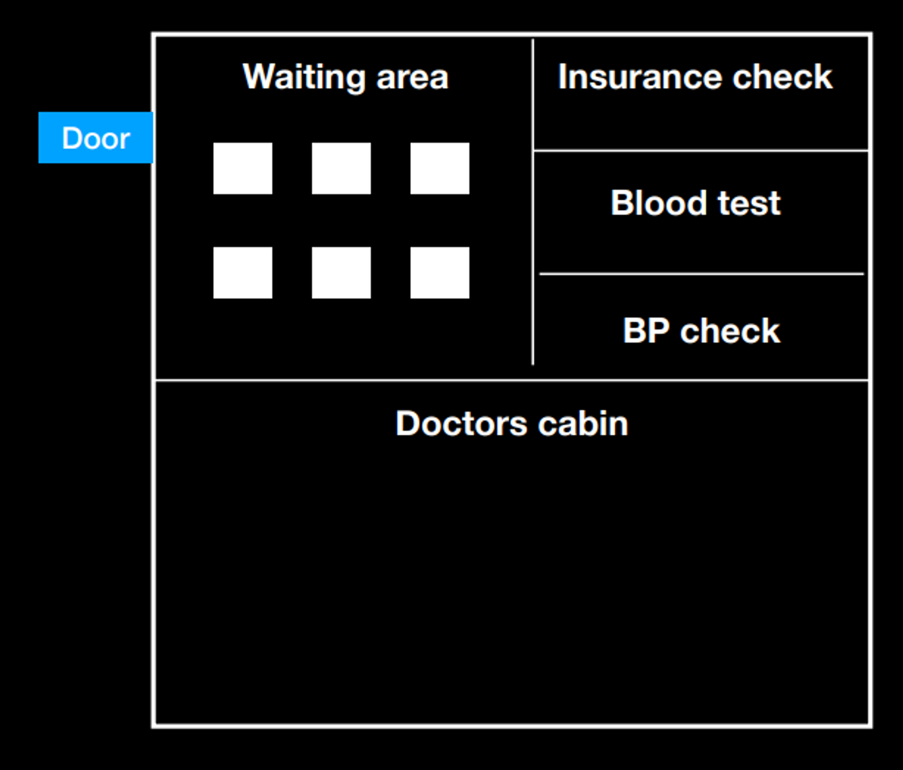

# Week 3

# Middlewares, Global Catches & Zod

In this lecture, Harkirat dives deep into `Middlewares`: behind-the-scenes helpers that tidy up things before your main code does its thing. `Global catches`: safety nets for your code, they catch unexpected issues before they cause chaos. And finally, `Zod`: a library that ensures efficient input validation on your behalf.

<p align='center'>

</p>

## Understanding Middlewares:

**Imagine a Busy Hospital:**  
Think of a hospital where there's a doctor, patients waiting in line, and a few helpful assistants making sure everything runs smoothly.

1. **Doctor's Cabin** `(Application Logic)` : The doctor is like the main brain of our hospital – ready to help patients with their problems.
2. **Waiting Room** `(Callback Queue)` :
The waiting room is where patients hang out before seeing the doctor. Each patient has a unique situation.
3. **Intermediates** `(Middlewares)` :
Before a patient sees the doctor, there are some helpers doing important tasks.
One helper checks if patients have the right paperwork . This is like ensuring everyone is who they say they are (Authentication)
Another helper does quick health checks – like making sure patients' blood pressure is okay. This is similar to checking if the information coming to the doctor is healthy and makes sense (Input Validation).

<p align='center'>

</p>

## Middlewares in JS Context & Problem Statement:
Earlier we used to organize all our prechecks followed by the application logic all in one route. Middlewares emerged as a solution to enhance code organization by extracting prechecks from the core application logic. The motivation behind their introduction lies in our commitment to the `"Don't Repeat Yourself" (DRY) principle`. 

By isolating these preliminary checks into distinct functions or code blocks known as middlewares, we achieve a more modular and maintainable codebase. This separation not only streamlines the primary application logic but also promotes code reuse, making it easier to manage, understand, and scale our software architecture.

`before using middlewares (the ugly way):`
```js
app.get("/health-checkup", (req, res) => {
  const { username, password } = req.headers;
  const kidneyId = req.query.kidneyId;
  if (username !== "Harkirat" || password !== "1234") {
    return res.status(400).json({
      message: "Invalid username or password",
    });
  }
  if (kidneyId !== "1" && kidneyId != "2") {
    return res.status(400).json({
      message: "Invalid KidneyId",
    });
  }
  res.json({
    message: "Your kidney is healthy!",
  });
});
```
`after using middlewares:`
```js
const userMiddleware = (req, res, next) => {
  const { username, password } = req.headers;
  if (username !== "Harkirat" || password !== "1234") {
    return res.status(400).json({
      message: "Invalid username or password",
    });
  }
  next();
};
const kidneyIdMiddleware = (req, res, next) => {
  const kidneyId = req.query.kidneyId;
  if (kidneyId !== "1" && kidneyId != "2") {
    return res.status(400).json({
      message: "Invalid KidneyId",
    });
  }
  next();
};
app.get("/health-checkup", userMiddleware, kidneyIdMiddleware, (req, res) => {
  res.json({
    message: "Your kidney is healthy!",
  });
});
```
Furthermore, with middleware, we can easily include as many precheck functions as needed. This means we have the freedom to add various checks or operations to our application without making the main code complex. It's like having building blocks that we can mix and match to create a customized process for our application, making it more adaptable and easier to manage.