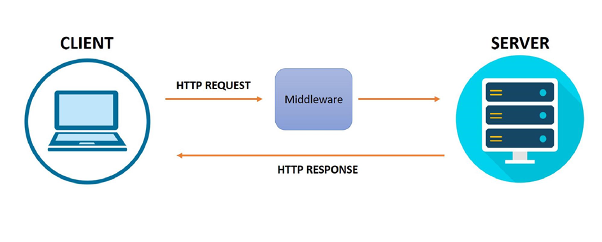

# Week 3

# Middlewares, Global Catches & Zod

In this lecture, Harkirat dives deep into `Middlewares`: behind-the-scenes helpers that tidy up things before your main code does its thing. `Global catches`: safety nets for your code, they catch unexpected issues before they cause chaos. And finally, `Zod`: a library that ensures efficient input validation on your behalf.

<p align='center'>

</p>

## Understanding Middlewares:

**Imagine a Busy Hospital:**  
Think of a hospital where there's a doctor, patients waiting in line, and a few helpful assistants making sure everything runs smoothly.

1. **Doctor's Cabin** `(Application Logic)` : The doctor is like the main brain of our hospital – ready to help patients with their problems.
2. **Waiting Room** `(Callback Queue)` :
The waiting room is where patients hang out before seeing the doctor. Each patient has a unique situation.
3. **Intermediates** `(Middlewares)` :
Before a patient sees the doctor, there are some helpers doing important tasks.
One helper checks if patients have the right paperwork . This is like ensuring everyone is who they say they are (Authentication)
Another helper does quick health checks – like making sure patients' blood pressure is okay. This is similar to checking if the information coming to the doctor is healthy and makes sense (Input Validation).

<p align='center'>

</p>

## Middlewares in JS Context & Problem Statement:
Earlier we used to organize all our prechecks followed by the application logic all in one route. Middlewares emerged as a solution to enhance code organization by extracting prechecks from the core application logic. The motivation behind their introduction lies in our commitment to the `"Don't Repeat Yourself" (DRY) principle`. 

By isolating these preliminary checks into distinct functions or code blocks known as middlewares, we achieve a more modular and maintainable codebase. This separation not only streamlines the primary application logic but also promotes code reuse, making it easier to manage, understand, and scale our software architecture.

`before using middlewares (the ugly way):`
```js
app.get("/health-checkup", (req, res) => {
  const { username, password } = req.headers;
  const kidneyId = req.query.kidneyId;
  if (username !== "Harkirat" || password !== "1234") {
    return res.status(400).json({
      message: "Invalid username or password",
    });
  }
  if (kidneyId !== "1" && kidneyId != "2") {
    return res.status(400).json({
      message: "Invalid KidneyId",
    });
  }
  res.json({
    message: "Your kidney is healthy!",
  });
});
```
`after using middlewares:`
```js
const userMiddleware = (req, res, next) => {
  const { username, password } = req.headers;
  if (username !== "Harkirat" || password !== "1234") {
    return res.status(400).json({
      message: "Invalid username or password",
    });
  }
  next();
};
const kidneyIdMiddleware = (req, res, next) => {
  const kidneyId = req.query.kidneyId;
  if (kidneyId !== "1" && kidneyId != "2") {
    return res.status(400).json({
      message: "Invalid KidneyId",
    });
  }
  next();
};
app.get("/health-checkup", userMiddleware, kidneyIdMiddleware, (req, res) => {
  res.json({
    message: "Your kidney is healthy!",
  });
});
```
Furthermore, with middleware, we can easily include as many precheck functions as needed. This means we have the freedom to add various checks or operations to our application without making the main code complex. It's like having building blocks that we can mix and match to create a customized process for our application, making it more adaptable and easier to manage.

## Some Associated Concepts:
1. `next() Keyword:`  
In middleware functions in Express, next is a callback function that is used to pass control to the next middleware function in the stack. When you call next(), it tells Express to move to the next middleware in line. If next() is not called within a middleware function, the request-response cycle stops, and the client receives no response. Example:
```js
app.use((req, res, next) => {
  console.log('This middleware runs first.');
  next(); // Move to the next middleware
});

app.use((req, res) => {
  console.log('This middleware runs second.');
  res.send('Response sent from the second middleware.');
});
```
2. `Difference between res.send and res.json:`  
`res.send:` Sends a response of various types (string, Buffer, object, etc.). Express tries to guess the content type based on the data provided.
`res.json:` Sends a JSON response. It automatically sets the Content-Type header to application/json.

3. `Importance of app.use(express.json()):`  
app.use(express.json()) is middleware that parses incoming JSON payloads in the request body. It is crucial when dealing with JSON data sent in the request body, typically in POST or PUT requests. Without this middleware, you might receive the JSON data as a raw string, and you'd need to manually parse it.
Example:
```js
const express = require('express');
const app = express();

app.use(express.json()); // Middleware to parse JSON in the request body

app.post('/api/data', (req, res) => {
  const jsonData = req.body; // Now req.body contains the parsed JSON data
  // Process the data...
  res.json({ success: true });
});
```
4. `Middleware and req.body:`  
req.query and req.headers don't require middleware because they represent the query parameters and headers of the incoming request, respectively. Express automatically parses them.
req.body requires middleware like express.json() to parse the request body, especially when the body contains JSON data. Other middleware, like express.urlencoded(), is used for parsing form data in the request body.
Middleware helps in processing the request at different stages and is essential for tasks like parsing, logging, authentication, and more in a modular and organized way.

## 3 Ways of Sending Inputs to a Response:

1. `Query Parameter:`  
What it is: Like giving specific instructions in the web address.  
Example: In www.example.com/search?topic=animals, the query parameter is topic with the value animals.  
Use Case: Good for simple stuff you want everyone to see, like search terms in a URL.

2. `Body:`  
What it is: Imagine it as the hidden part of a request, carrying more detailed information.  
Example: When you fill out a form on a website, the details you enter (name, email) go in the body of the request.  
Use Case: Great for sending lots of information, especially when you're submitting something like a form.

3. `Headers:`  
What it is: Extra information attached to the request, kind of like details about a letter.  
Example: Headers could include things like your identity or the type of data you're sending.  
Use Case: Perfect for passing along special information that doesn't fit neatly in the URL or body, like who you are or how to handle the data.

Bottom Line:  
`Query Parameters:` Simple instructions visible in the web address.  
`Body:` Hidden part of the request for more detailed info, great for forms.  
`Headers:` Extra details about the request, useful for special information.
 
# Global Catches:
It essentially help us the developers give a better error message to the user.
 
`Global Catch` or `Error-Handling Middleware` is a special type of middleware function in Express that has four arguments instead of three ((err, req, res, next)). Express recognizes it as an error-handling middleware because of these four arguments.

```js
// Error Handling Middleware
const errorHandler = (err, req, res, next) => {
  console.error('Error:', err);

  // Customize the error response based on your requirements
  res.status(500).json({ error: 'Something went wrong!' });
};
```
## Importance of Global Error Handling:
1. `Centralized Handling:`  
Global catch blocks allow you to centrally manage and handle errors that occur anywhere in your application. Instead of handling errors at each specific location, you can capture and process them in a centralized location.
2. `Consistent Error Handling:`  
Using a global catch mechanism ensures a consistent approach to error handling throughout the application. You can define how errors are logged, reported, or displayed in one place, making it easier to maintain a uniform user experience.
3. `Fallback Mechanism:`  
Global catches often serve as a fallback mechanism. If an unexpected error occurs and is not handled locally, the global catch can capture it, preventing the application from crashing and providing an opportunity to log the error for further analysis.