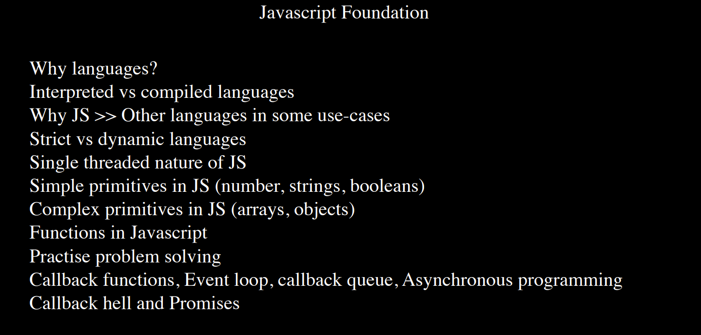
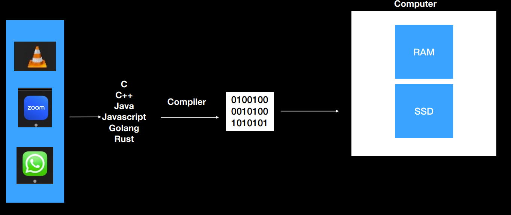
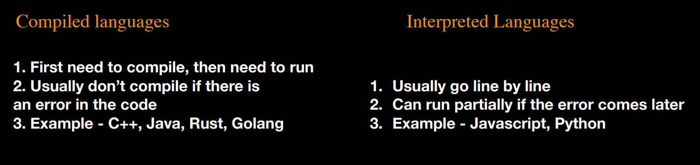

# Week 1.2

## Topics being covered : 

### 1. Why Languages?
Firstly, lets understand how applications run in our computer. All the applications reside in our SSD. But when we double click on any application, it goes into ram. And by 'it', i mean the 0s and 1s and not any c++ code or java code. This is because the computer only understands 0s and 1s.  And its not human to write the code in 0s & 1s. Thats why we require these high level languages to write our code, which is then converted to machine level code by something known as a compiler.

### 2. Interpreted vs Compiled languages
Compilers convert high level developer friendly code into 0s and 1s.  
C++ is a compiled language. So the complete c++ code is first converted into binary code and then its run on the computer (ie, put in the ram). Whereas Javascript is an interpreted language. Here, the code is not compiled in one go, but its done line by line. First, the first line gets compiled and run, then second then third and so on. So Interpreted languages go line by line while executing, can partially run until an error comes.

### 3. Why is JS better than other languages?
Browsers can only understand HTML/CSS/JS (not technically true though).
Thanks to Node.js , Javascript can also be used for “Backend Development”

### 4. Static vs dynamic languages
In a statically typed language, ex. c++, data types are defined during compile time and cannot change during runtime. This behavior is because of static type checking. In contrast, dynamic typing allows variables to change their data type during runtime just like JavaScript.

### 5. Single threaded nature of JS
A single-threaded language is one that can execute only one task at a time. The program will execute the tasks in sequence, and each task must complete before the next task starts. Other languages, like Python or Java, are multi-threaded and can execute multiple tasks simultaneously.

### 6. Simple primitives

