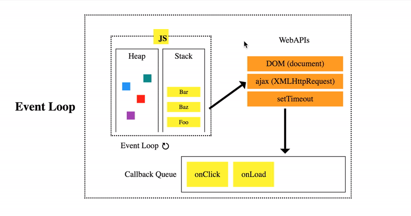

# Week 1.5

### In this lecture, we covered these topics:
1. Async functions vs sync functions
2. real use of callbacks
3. JS Browser architecture
4. Promises
5. Async await

### 1. Async functions vs sync functions
**Asynchronous** is a non-blocking architecture, so the execution of one task isn't dependent on another. Tasks can run simultaneously. Whereas, **Synchronous** is a blocking architecture, so the execution of each operation depends on completing the one before it. Each task requires an answer before moving on to the next iteration.

**Synchronous Javascript**:  
As the name suggests synchronous means to be in a sequence, i.e. every statement of the code gets executed one by one. So, basically a statement has to wait for the earlier statement to get executed.
```js
document.write("Hi"); // First 
document.write("<br>");
 
document.write("Mayukh");// Second 
document.write("<br>");
 
document.write("How are you"); // Third
```
Output : 
```
Hi
Mayukh
How are you
```
So as we can see the codes work in a sequence. Every line of code waits for its previous one to get executed first and then it gets executed.


**Asynchronous Javascript**:  
```js
document.write("Hi");
document.write("<br>");
 
setTimeout(() => {
    document.write("Let us see what happens");
}, 2000);
 
document.write("<br>");
document.write("End");
document.write("<br>");
```
Output :
```
Hi
End
Let us see what happens
```
At first, as usual, the Hi statement got logged in. As we use browsers to run JavaScript, there are something known as `web APIs` that handle async functions for us. So, what JavaScript does is, it passes the setTimeout function in one such web API and then moves forward with running the code as usual. So it does not block the rest of the code from executing. After the Web api is done with that async code, it pushes the code inside the `callback queue`. Now comes the `event loop`, which runs continuously and checks the Main stack(the call stack), if it has any frames to execute. if not, then it checks the callback queue. If the callback queue has codes to execute, then it pops the message(code) from it and pushes it to the Main Stack for the execution. This is what happens in asynchronous JavaScript.



